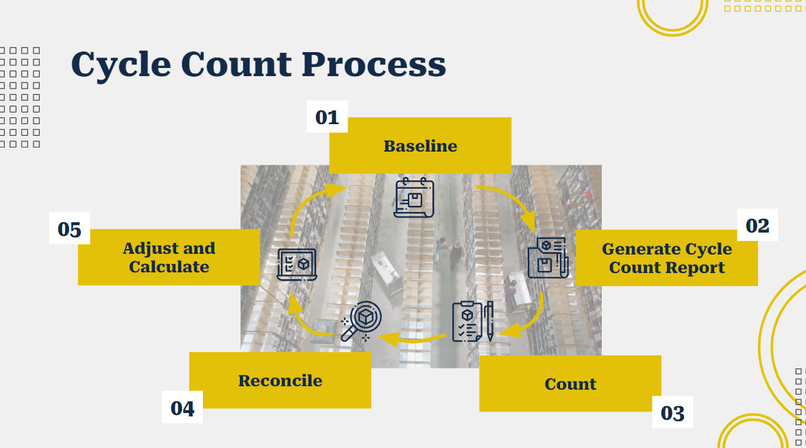
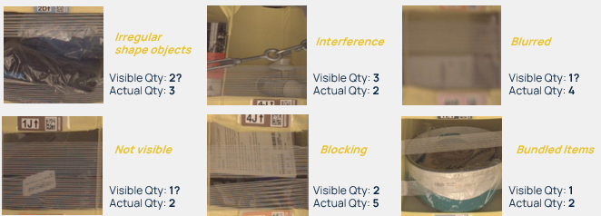
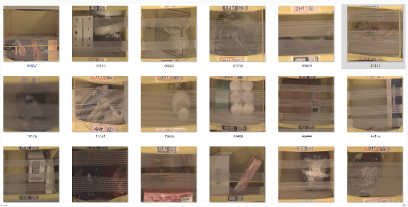
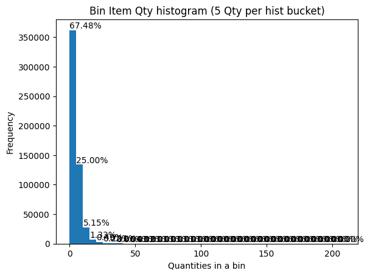
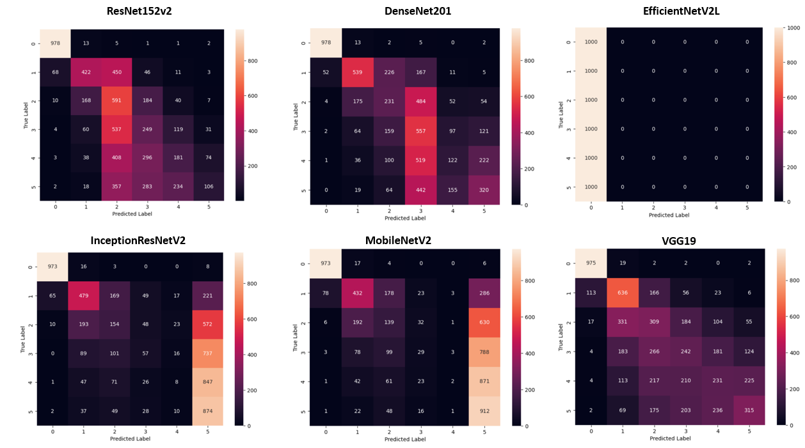

# DSI Capstone Project - Automated Inventory Counting in Fulfillment Centers Using Deep Learning

Authors: ChungYau Chin

- [Executive Summary](#executive-summary)
- [Data Source](#data-source)
- [Challenges and Assumptions](#challenges-and-assumptions)
- [Approach](#approach)
- [Exploratory Data Analysis](#exploratory-data-analysis-eda)
- [Data Preprocessing](#data-preprocessing)
- [Machine Learning Model](#machine-learning-model)
- [Result and Future Work](#results-and-future-work)
- [Conclusion](#conclusion)

---

## Executive Summary

Cycle counting (also known as stocktaking) is a critical inventory management process ensuring that physical inventory in a warehouse matches recorded quantities. Maintaining accurate inventory levels is crucial for efficient order fulfillment and smooth warehouse operations. While various cycle counting methods exist (e.g., ABC counting, zone counting)[^l1], steps like physically counting and reconciling items remain labor-intensive.


*Figure 1: The Cycle of Cycle Counting

This project investigates the potential of machine learning to automate or assist the inventory counting process. Utilizing the Amazon Bin Image Dataset, I explored pre-trained Convolutional Neural Network (CNN) models to count objects within bins. VGG19 emerged as the top-performing model with an overall accuracy of 53% and strong performance on per-class recall. This project demonstrates the feasibility of CNN-based object counting, paving the way for potential counting automation even in environments with less-than-ideal camera setups.

## Data Source

The Amazon Bin Image Dataset[^l3], comprising over 500,000 images and metadata from bins within an Amazon fulfillment center, served as our dataset. Each image is accompanied by a JSON file containing metadata describing the bin's contents, including stock-keeping units (SKUs) and their quantities.

Figure 2 shows a sample of the JSON message for `00001.jpg` image. Attribute `BIN_FCSKU_DATA` carries the SKUs (Stock Keeping Unit, i.e. product model) available in the bin. The SKU details, such as description, quantity, dimension, etc are provided in the Level -2 to -4 attributes. Attribute `EXPECTED_QUANTITY` shows how many objects available in the bin. This will be used as the label for the bin.

```
{
  "BIN_FCSKU_DATA": {
    "B000C33MI2": {
      "asin": "B000C33MI2",
      "height": {
        "unit": "IN",
        "value": 2.79921259557
      },
      "length": {
        "unit": "IN",
        "value": 3.90157479917
       },
      "name": "FRAM XG7317 ULTRA Spin-On Oil Filter with Sure Grip",
      "normalizedName": "FRAM XG7317 ULTRA Spin-On Oil Filter with Sure Grip",
      "quantity": 4,
      "weight": {
        "unit": "pounds",
        "value": 0.3000050461296
      },
      "width": {
        "unit": "IN",
        "value": 2.90157480019
      }
    },
    "B0050Z27KG": {
      "asin": "B0050Z27KG",
      "height": {
        "unit": "IN",
        "value": 0.899999999082
      },
      "length": { 
        "unit": "IN",
        "value": 11.299999988474
      },
      "name": "Suncatcher - Axicon Rainbow Window - Includes Bonus \"Rainbow on Board\" Sun Catcher",
      "normalizedName": "Suncatcher - Axicon Rainbow Window - Includes Bonus \"Rainbow on Board\" Sun Catcher",
      "quantity": 2,
      "weight": {
        "unit": "pounds",
        "value": 0.5
      },
      "width": {
        "unit": "IN",
        "value": 7.699999992146
      }
    },
    "B01BV89HNU": {
      "asin": "B01BV89HNU",
      "height": {
        "unit": "IN",
        "value": 2.1999999977560005
      },
      "length": {
        "unit": "IN",
        "value": 3.99999999592
      },
     "name": "Type C, iOrange-E 2 Pack 6.6 Ft Braided Cable for Nexus 6P, ... Nokia N1   Tablet and Other USB C Devices, Black",
     "normalizedName": "2 Pack Type C, iOrange-E 6.6 Ft Braided Cable for ... Nokia N1 Tablet and Other USB C Devices, Black",
     "quantity": 6,
     "weight": {
       "unit": "pounds",
       "value": 0.3499999997064932
     },
     "width": {
       "unit": "IN",
       "value": 3.899999996022
     }
   }
 },
 "EXPECTED_QUANTITY": 12
 }
```

Figure 2: JSON metadata of 00001.jpg

## Challenges and Assumptions

- **Computational Resources:** The dataset's size (3.34 GB) posed a computational challenge.
- **SKU Diversity:** The vast number of unique SKUs (>460,000) precluded the use of object detection approaches that rely on bounding boxes.
- **Image Quality:** Many images exhibited quality issues like blurriness, occlusions, and bundled items. While these impact model performance, they reflect real-world conditions and were included in the analysis.



## Approach

To address these challenges, I focused on counting bins containing up to 5 items, aligning with the moderate difficulty level of the Amazon Bin Image Dataset (ABID) challenge[^l4]. I also ***assumed*** the metadata accurately reflected bin contents.

## Exploratory Data Analysis (EDA)

Key findings from the EDA include:

- The dataset comprises 536,434 images, each representing a single bin location within the fulfillment center.



Figure 3: Snapshot of the Bin Images

- The dataset exhibits high SKU diversity, with 460,515 unique SKUs. Notably, 71.5% of SKUs are located in only one or two bin locations, and nearly 90% are found in five or fewer locations.
- Approximately 67.5% of the images depict bins containing five or fewer items, including empty bins.



| Bin Item Quantity | Number of Images | Percentage of Images | Cumm. Sum. |
| ----------------- | ---------------- | -------------------- | ---------- |
| 0                 | 9901             | 1.85%                | 1.85%      |
| 1                 | 41347            | 7.71%                | 9.55%      |
| 2                 | 77063            | 14.37%               | 23.92%     |
| 3                 | 90258            | 16.83%               | 40.74%     |
| 4                 | 80750            | 15.05%               | 55.80%     |
| 5                 | 62648            | 11.68%               | 67.48%     |
| 6                 | 46058            | 8.59%                | 76.06%     |
| 7                 | 33684            | 6.28%                | 82.34%     |
| 8                 | 24219            | 4.51%                | 86.86%     |
| 9                 | 17298            | 3.22%                | 90.08%     |
| 10                | 12823            | 2.39%                | 94.47%     |
| ...               | ...              | ...                  | ...        |

## Data Preprocessing

I extracted item and quantity information from metadata to facilitate image filtering. Images were resized to 224x224 pixels and converted to NumPy arrays. Labels for model training were derived from the metadata's "expected quantity" field.

To mitigate the impact of low-quality images on model training, a Laplacian variance filter was applied to the dataset. This filter identifies blurred images by measuring the variance of their Laplacian gradients. A variance threshold of 100 was selected, resulting in the removal of 15% of the images deemed to be excessively blurred.

Image Augmentation were considered during the model evaluation using the Keras' `ImageDataGenerator`. Given the marginal improvement gained from applying image augmentation techniques (e.g. horizontal/vertical flip, zoom, shear range, etc), in the expenses of 3-5 times model training additional time requires, Image Augmentation was removed fro the final model training. The huge amount of image data set in the Amazon Bin Image Challenge had sufficient model training data.

## Model Evaluation and Selection 

***Methodology***
I have evaluated using the following pre-trained Convolutionary Neural Network (CNN) models as transfer learning for my model training. The implementation was based on Tensorflow Keras[^l5]

- ResNet152V2
- DenseNet201
- EfficientNetV2L
- InceptionResNetV2
- MobilenetV2
- VGG19

| Pre-trained CNN Model  | Description                                                                                                                                                                                                                                                             | Strength                                                                                                                                                                                                                                       | Weakness                                                                                                                                                                          |
| ---------------------- | ----------------------------------------------------------------------------------------------------------------------------------------------------------------------------------------------------------------------------------------------------------------------- | ---------------------------------------------------------------------------------------------------------------------------------------------------------------------------------------------------------------------------------------------- | --------------------------------------------------------------------------------------------------------------------------------------------------------------------------------- |
| ResNetV152V2[^l6]      | ResNet152V2 is a deep residual network that incorporates "residual blocks" which help in mitigating the vanishing gradient problem. This model is an improvement over the original ResNet architecture with a reformulated version of residual blocks.                  | - Excellent performance on large-scale image classification tasks.<br /><br />- Deeper network with 152 layers, which enables learning very complex features.                                                                                  | - Computationally intensive and requires significant memory and processing power.<br /><br />- Longer training time due to the increased depth.                                   |
| DenseNet201[^l7]       | DenseNet201 is part of the Dense Convolutional Network (DenseNet) family. It connects each layer to every other layer in a feed-forward fashion, meaning each layer receives the feature maps of all preceding layers.                                                  | - Efficient use of parameters, leading to less memory usage.<br /><br />- Alleviates the vanishing-gradient problem.<br /><br />- Encourages feature reuse in the feed-forward design approach, thus improving learning efficiency.            | - Can become computationally expensive with a large number of layers.<br /><br />- May suffer from high memory consumption due to the concatenation of feature maps.              |
| EfficientNetV2L[^l8]   | EfficientNetV2 is an improved version of EfficientNet, designed to be both faster and more accurate. The "L" denotes one of the larger variants of the model. It uses a combination of neural architecture search and scaling principles to achieve better performance. | - High accuracy with a relatively smaller model size.<br /><br />- Efficient scaling of network depth, width, and resolution.                                                                                                                  | - Complexity in architecture may make it harder to understand and implement from scratch.<br /><br />- Requires careful tuning of hyperparameters to achieve optimal performance. |
| InceptionResNetV2[^l9] | InceptionResNetV2 combines the Inception architecture with residual connections. This model leverages the benefits of both Inception modules (which capture multi-scale features) and residual connections (which ease the training of deep networks).                  | - Good balance between depth, performance, and computational efficiency.<br /><br />- Residual connections improve training stability and convergence speed.<br /><br />- Capable of handling a variety of complex image classification tasks. | - More complex architecture can be challenging to modify.<br /><br />- Higher computational and memory requirements compared to simpler models.                                   |
| MobileNetV2[^l10]      | MobileNetV2 is designed specifically for mobile and embedded vision applications. It uses depthwise separable convolutions to reduce the number of parameters and computational cost.                                                                                   | - Lightweight and efficient, making it suitable for mobile devices.<br /><br />- High performance per parameter, providing a good balance of accuracy and efficiency. <br /><br />- Faster inference times due to reduced model size.          | - Lower accuracy compared to larger, more complex models.<br /><br />- May not perform as well on very large or complex datasets.                                                 |
| VGG19[^l11]            | VGG19 is part of the Visual Geometry Group (VGG) models, known for its simplicity and uniform architecture consisting of 19 layers. It is a deep learning model using a very small convolution filters (3x3)                                                            | - Simple and uniform architecture that is easy to understand and implement.<br /><br />- High performance on image classification benchmarks. <br /><br />- Good feature extraction capabilities.                                              | - Very large model size with a high number of parameters.<br /><br />- High computational cost and memory usage. <br /><br />- Relatively slower inference times.                 |

For each model: 
1. **Transfer Learning Initialization**: ImageNet weights were loaded as the initial model parameters to leverage knowledge learned from a large-scale image classification task.
2. **Architecture Modification**: The top fully connected (FC) layers were removed and replaced with two new FC layers of 256 nodes each, interspersed with a dropout layer (rate = 0.55). A final FC layer with 6 nodes and softmax activation was added for the 6-class bin image object count classification. This customization allows the model to adapt to the specific task while retaining the learned features from the convolutional layers.
3. **Training Configuration**: The AdamW optimizer was used with a base learning rate of 0.0001. All models were trained for 20 epochs with a batch size of 128. Early stopping was implemented to prevent overfitting.

A snapshot of the create model function for creating the ResNetModel, similarly for other models as well.

```
def create_ResnetModel():
pre_trained_model = ResNet152V2(include_top = False,
weights="imagenet",
input_shape=train_images.shape[1:])
pre_trained_model.trainable = Falsex = pre_trained_model.output
x = Flatten()(x)
x = Dense(256, activation='relu')(x)
x = Dropout(0.55)(x)
x = Dense(256, activation='relu')(x)
x = Dropout(0.55)(x)
predictions = Dense(nClasses, activation='softmax')(x)

model = Model(inputs=pre_trained_model.input, outputs=predictions)
model.summary(show_trainable=True)

return model
```

***Evaluation Metrics***
1. Primary Metric: Accuracy (overall proportion of correct predictions)
2. Secondary Metric: Per-class recall (sensitivity), focusing on the ability to correctly identify the true number of objects in a bin, especially for higher object counts.
3. Additional Analysis: Confusion matrices were generated to assess class-level performance and identify patterns of misclassification.

***Results and Discussion***
Most models achieved similar accuracy scores (ranging from 0.41 to 0.45), with the exception of EfficientNetV2L, which underperformed significantly (0.1667 accuracy).

| Model             | Accuracy | Qty0_Recall | Qty1_Recall | Qty2_Recall | Qty3_Recall | Qty4_Recall | Qty5_Recall |
| ----------------- | -------- | ----------- | ----------- | ----------- | ----------- | ----------- | ----------- |
| ResNet152V2       | 0.4212   | 0.978       | 0.422       | 0.591       | 0.249       | 0.181       | 0.106       |
| DenseNet201       | 0.4578   | 0.978       | 0.539       | 0.231       | 0.557       | 0.122       | 0.32        |
| EfficientNetV2L   | 0.1667   | 1.0         | 0.0         | 0.0         | 0.0         | 0.0         | 0.0         |
| InceptionResNetV2 | 0.4242   | 0.973       | 0.479       | 0.154       | 0.057       | 0.008       | 0.874       |
| MobilenetV2       | 0.4145   | 0.973       | 0.432       | 0.139       | 0.029       | 0.002       | 0.912       |
| VGG19             | 0.4513   | 0.975       | 0.636       | 0.309       | 0.242       | 0.231       | 0.315       |


While overall accuracy provides a general overview, the per-class recall revealed a consistent trend:
- High Recall at Qty 0: All models excelled at identifying bins with zero objects.
- Decreasing Recall with Higher Object Counts: As the number of objects increased, the recall dropped across all models, reflecting the growing complexity of the task.



In the context of multi-class classification, a confusion matrix provides a detailed breakdown of the model's performance. Each row of the matrix corresponds to the true label (actual number of objects in a bin), while each column represents the predicted label. The diagonal elements of the matrix indicate the number of correct predictions for each class. For instance, the value of 975 in the top-left corner of the VGG19 confusion matrix indicates that the model correctly predicted 975 instances of bins with zero objects.

The off-diagonal elements reveal misclassifications. Values within a row but off the diagonal represent false negatives for that true class – cases where the model predicted a different count than the actual number of objects. Conversely, values within a column but off the diagonal represent false positives for that predicted class – cases where the model predicted that class, but the actual class was different.

VGG19 demonstrated the best overall performance in terms of per-class recall, particularly for higher object counts. Its confusion matrix also exhibited a desirable pattern with a higher concentration of correct predictions along the diagonal and decreasing density further away. This suggests that when the model make errors, it is more likely to predict a quantity close to the true value, rather than a wildly different one. The matrix also does not exhibit an overwhelming bias towards predicting a particular class, demonstrating the model's ability to differentiate between various object counts. 
 
Based on the evaluation results, VGG19 was selected as the most promising model for further hyperparameter tuning


## Results and Future Work

VGG19 achieved an overall accuracy of 55.3% and showed promising recall per class. While image quality limitations likely affected performance, the results demonstrate the potential of CNNs for automated inventory counting.

The model trained on the Amazon Bin Image Dataset could serve as a valuable starting point for object counting in other warehouse settings. By fine-tuning this pre-trained model with bin images specific to each warehouse, a rapid and cost-effective customization process can be achieved. This approach leverages the knowledge gained from the extensive Amazon dataset while tailoring the model to the unique characteristics of individual warehouses.

## Conclusion

This project successfully demonstrated the feasibility of utilizing machine learning, particularly CNNs, for automated inventory counting in fulfillment centers. The insights gained pave the way for further research and development in this area, potentially leading to significant efficiency gains in warehouse operations.

*Reference:*

[^l1]: https://www.bigcommerce.com/glossary/inventory-cycle-count/
    
[^l2]: https://www.netsuite.com.sg/portal/sg/resource/articles/inventory-management/using-inventory-control-software-for-cycle-counting.shtml
    
[^l3]: https://registry.opendata.aws/amazon-bin-imagery
    
[^l4]: https://github.com/silverbottlep/abid_challenge
    
[^l5]: https://keras.io/api/applications/
    
[^l6]: Identity Mappings in Deep Residual Networks: https://arxiv.org/abs/1603.05027
    
[^l7]: Densely Connected Convolutional Networks: https://arxiv.org/abs/1608.06993
    
[^l8]: EfficientNetV2: Smaller Models and Faster Training: https://arxiv.org/abs/2104.00298
    
[^l9]: Inception-v4, Inception-ResNet and the Impact of Residual Connections on Learning: https://arxiv.org/abs/1602.07261
    
[^l10]: MobileNetV2: Inverted Residuals and Linear Bottlenecks: https://arxiv.org/abs/1801.04381
    
[^l11]: Very Deep Convolutional Networks for Large-Scale Image Recognition: https://arxiv.org/abs/1409.1556
